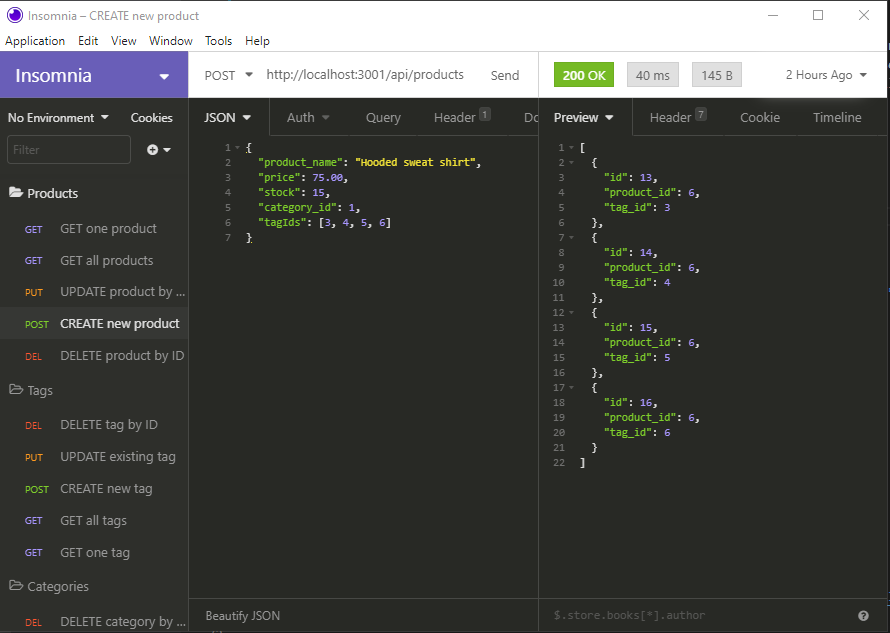
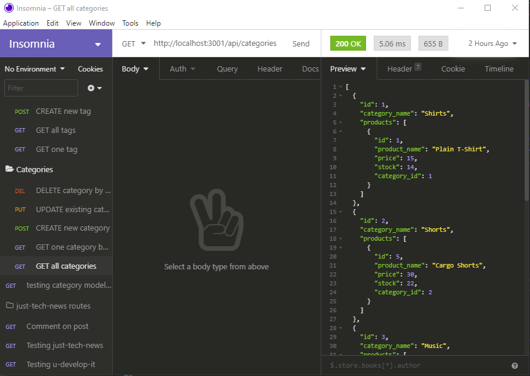

# **E-commerce Back End**       

## **Description**

ReadMe-generator does exactly that.  As a Node.js powered command line application it creates a professional, and stylish README.md file based on a user's input. This input is created by a user responding to prompts generated with the Inquirer npm.

Here is a walkthrough of the database being queried using the Insomnia app: **[E-Commerce-Backend Testing Walkthrough](https://drive.google.com/file/d/1Fq4TQsOYTVuw6dIc5TZMOIKpgSD8GBEF/view)**

## User Story:

- GIVEN a functional Express.js API
- WHEN I add my database name, MySQL username, and MySQL password to an environment variable file
- THEN I am able to connect to a database using Sequelize
- WHEN I enter schema and seed commands
- THEN a development database is created and is seeded with test data
- WHEN I enter the command to invoke the application
- THEN my server is started and the Sequelize models are synced to the MySQL database
- WHEN I open API GET routes in Insomnia Core for categories, products, or tags
- THEN the data for each of these routes is displayed in a formatted JSON
- WHEN I test API POST, PUT, and DELETE routes in Insomnia Core
- THEN I am able to successfully create, update, and delete data in my database

## **Table of Contents**

* *[Installation](#installation)*
* *[Usage Instructions](#usage-instructions)*
* *[Contributing](#contributing)*
* *[Technology](#technology)*
* *[Tests](#tests)*
* *[Questions](#questions)*
* *[License](#license)*
* 

## **Installation**

To use/try this application, first- `clone` or `fork/clone` this repository(see contributing section).  Install the required dependencies for this project using the command: `npm install` or `npm i`. This will install: **[mySQL](https://www.npmjs.com/package/mysql2)**,  **[dotenv](https://www.npmjs.com/package/dotenv)**, **[express](https://www.npmjs.com/package/express)**, and **[sequelize](https://www.npmjs.com/package/sequelize)** using the command `node index.js` from the command line.

## **Usage-instructions**

Open the mySQL CLI using the command `mysql -u root -p` in the terminal.  You will be prompted to enter you mySQL password. Enter the command `USE ecommerce_db;` then create the schema from the MySQL shell using the command `source .db/schema.sql;`, you may now quit the MySQL shell by simply typing `quit` and hitting the return key. Back in the command line you can now source the seed files for the application with the command `npm run seed` this will populate the table.  Finally, enter `npm start` or `node server.js` to start and the server and begin interfacing with the database.   

Keep in mind, if you make any changes to the file in the models directory you will need to rebuild the database.  To do this navigate the the `server.js` file in the root directory.  At the bottom of the file chance `force: false` to `force: true`, once you've done this use the command `npm start` to rebuild the database with your changes.  Now change `true` back to `false`, quit the server with the `control + c` command and restart with `npm run` or `npm install`.  Your changes should now take effect

## **Screenshots**
A .gif of the walktrough:  
  

Successfully POST request to Products:  

Sucessful GET request for all Categories:  

## **Contributing**

Please refer to the **[Contributor Covenant](https://www.contributor-covenant.org/)** for contribution guidelines.

## **Technology**

This project was completed using: 
- `Node.js`
- `Sequelize`
- `MySQL2`
- `Dotenv`
- `Express`
- `Insomnia`.

## **Tests**  

No test need to be run at this time. 

## **Questions**

For any questions, comments, or feedback please feel free to reach out:  
- **[Github](https://github.com/gintstir)** 
- **<gint.stirbys@gmail.com>**

## **License** 

Copyright © Gintautas Stirbys, 2021.  All Rights Reserved.

This Project is licensed under the **[Apache~2.0](https://www.apache.org/licenses/LICENSE-2.0)** license.

        

